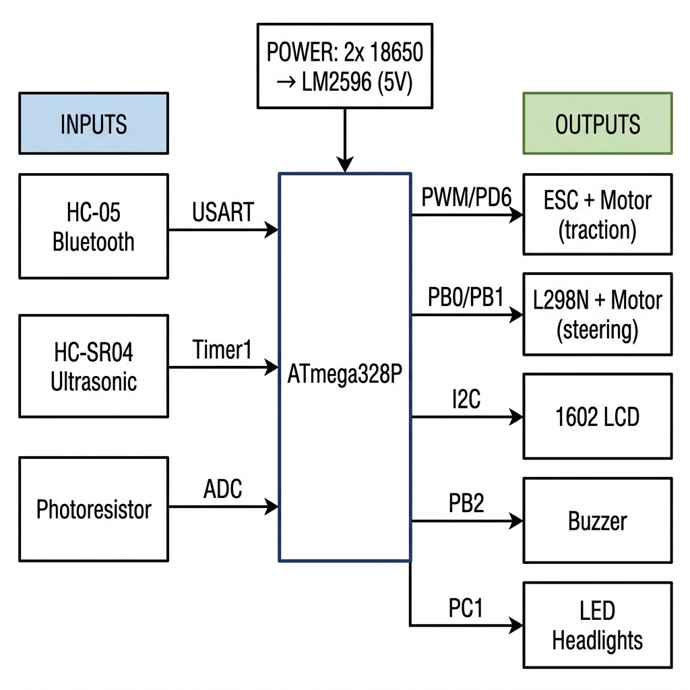
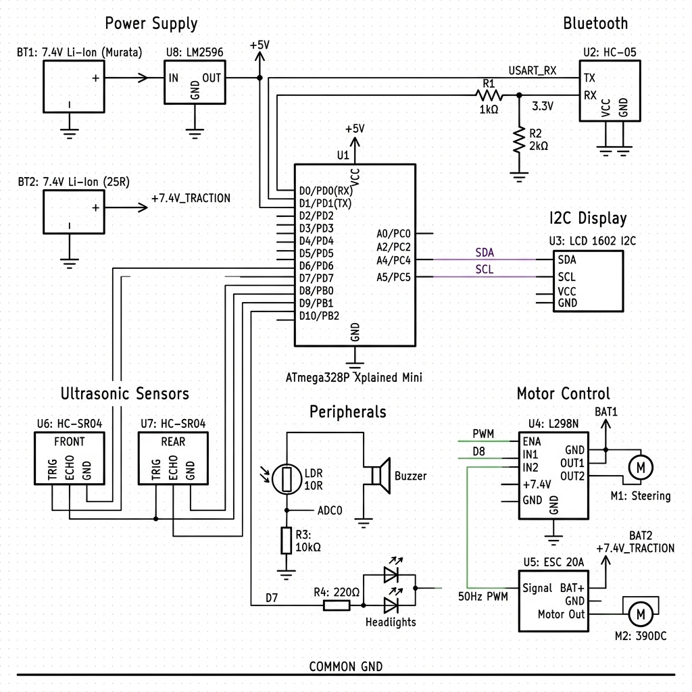

# Land Buster — Autonomous & Multi-Mode Bluetooth Rover

Cucu Viorel-Cosmin 334CA

> **GitHub:** [https://github.com/cuculetz11/PROIECT_PM_MASINUTA](https://github.com/cuculetz11/PROIECT_PM_MASINUTA)  
> **MCU:** ATmega328P Xplained Mini · PlatformIO

---

## Introduction

**Land Buster** is a small RC car (1/12 scale Land Buster chassis) that I upgraded into a smart rover. Instead of using a standard radio remote, I control it from my phone via Bluetooth.

The main idea was simple: a normal RC car does whatever you tell it, even if it is about to crash. I wanted to fix that. So I added sensors and automatic logic on top of the manual control.

**What it does:**
- You drive it with a phone app over Bluetooth. You can pick between 3 speed modes and honk the horn.
- The front ultrasonic sensor watches for obstacles. The buzzer starts beeping faster as you get closer. If you get too close (under 15 cm), the car stops by itself — you cannot override it.
- The headlights turn on automatically when it gets dark, based on a light sensor.
- The LCD screen shows the current speed mode and the distance to the nearest obstacle in real time.

**Why it is useful:** It shows how a cheap microcontroller can handle multiple real-time tasks at once — wireless communication, sensing, motor control, and display — using only hardware registers and no external libraries.

**Course requirements met:**
- **5 laboratory concepts:** USART (Lab 1), Timers & Interrupts (Lab 2), PWM (Lab 3), ADC (Lab 4), I2C (Lab 6)
- **5 external peripherals:** HC-05 Bluetooth, HC-SR04 Ultrasonic, 1602 I2C LCD, Photoresistor, Active Buzzer

---

## General Description

The ATmega328P is the brain of the system. Everything connects to it.

- **Inputs:** Bluetooth commands from the phone, distance data from the ultrasonic sensor, light level from the photoresistor.
- **Processing:** The MCU reads all inputs, decides what to do (drive, stop, beep, light up), and sends signals to the outputs.
- **Outputs:** The ESC drives the main motor (speed), the L298N drives the steering motor (direction), the LCD shows status, the buzzer gives audio alerts, and the LEDs provide lighting.

### Block Diagram



---

## Hardware Design

### Component List

| Component | Model | Role |
|---|---|---|
| Microcontroller | ATmega328P Xplained Mini | Main brain |
| Bluetooth | HC-05 | Receives phone commands |
| Ultrasonic Sensor | HC-SR04 | Measures front distance |
| Light Sensor | GL5528 Photoresistor | Measures ambient light |
| Speed Controller | 20A Brushed ESC | Controls traction motor |
| Traction Motor | 390 DC Motor (7.4V) | Moves the car forward/backward |
| Steering Motor | 3–6V DC Motor | Turns left/right |
| Motor Driver | L298N H-Bridge | Drives the steering motor |
| Display | 1602 LCD + PCF8574 I2C | Shows speed mode and distance |
| Buzzer | 5V Active Buzzer | Proximity beep and horn |
| Headlights | 5mm LEDs x2 | Automatic lighting |
| Voltage Regulator | LM2596 Step-Down | Converts 7.4V to 5V for logic |
| Battery | 2x 18650 Li-Ion | Power source (7.4V) |
| Chassis | Land Buster 1/12 scale | Physical base |
| Connectors | JST 2/3/5-pin + terminal blocks | Clean and safe wiring |

### Pin Mapping

| MCU Pin | Role | Connected To |
|---|---|---|
| PD0 (RXD) | USART RX | HC-05 TX |
| PD1 (TXD) | USART TX | HC-05 RX (via 1kΩ/2kΩ divider) |
| PD2 | Trigger output | HC-SR04 Trigger |
| PD4 | Echo input | HC-SR04 Echo |
| PD6 (OC0A) | PWM output | ESC signal |
| PB0 | Direction output | L298N IN1 |
| PB1 | Direction output | L298N IN2 |
| PB2 | Digital output | Active Buzzer |
| PC0 (ADC0) | Analog input | Photoresistor divider |
| PC4 (SDA) | I2C data | LCD PCF8574 |
| PC5 (SCL) | I2C clock | LCD PCF8574 |

### Key Design Choices

**Dual power rail:** The ESC and motor run directly on 7.4V from the batteries. All logic (MCU, sensors, LCD) runs on 5V from the LM2596 step-down module. This keeps motor noise away from the sensitive electronics.

**HC-05 voltage protection:** The HC-05 uses 3.3V logic on its RX pin. A simple resistor divider (1kΩ + 2kΩ) on the MCU TX → HC-05 RX line drops 5V down to 3.3V so the module is not damaged.

**Two separate motor drivers:** The 390 traction motor needs high current at 7.4V, so it uses the ESC. The small steering motor runs at 3–6V and is controlled by the L298N, which is perfect for low-power direction switching.

**Modular Hardware Implementation:** To ensure a clean and reliable hardware execution, the system utilizes a modular wiring setup consisting of male-female and female-female jumpers organized through 2-pin, 3-pin, and 5-pin connectors and terminal blocks, preventing any connections from shaking loose during rover movement.

### Electrical Schematic



---

## Software Design

### Development Environment

- **IDE:** PlatformIO (VS Code)
- **Language:** Pure AVR C — all peripherals are controlled via direct register writes. No Arduino libraries.
- **Compiler:** avr-gcc
- **Target:** ATmega328P Xplained Mini

### Source Files

```
src/
├── main.c          # Main loop, ISR, command dispatcher
├── usart.c / .h    # USART driver + printf via stdout (Lab 1)
├── ultrasonic.c    # HC-SR04 distance measurement (Lab 2)
├── motor.c         # PWM steering control via L298N (Lab 3)
├── adc.c / .h      # ADC driver for photoresistor (Lab 4)
└── task1.c         # ADC read + threshold logic (tested standalone)
```

### Lab 1 — USART: Bluetooth Control

The HC-05 sends bytes from the phone app at 9600 baud. The **RX Complete Interrupt (RXCIE0)** fires automatically when a byte arrives.

```c
// usart.c
void USART0_init(unsigned int ubrr) {
    UBRR0H = (unsigned char)(ubrr >> 8);
    UBRR0L = (unsigned char)ubrr;
    UCSR0B = (1 << RXEN0) | (1 << TXEN0) | (1 << RXCIE0);
    UCSR0C = (1 << USBS0) | (3 << UCSZ00); // 8-bit, 2 stop bits
}
```

```c
// main.c — ISR
volatile char comanda_bt = 0;

ISR(USART_RX_vect) {
    char c = UDR0;
    if (c != '\r' && c != '\n') comanda_bt = c;
}
```

Commands: `F` Forward, `B` Backward, `L` Left, `R` Right, `S` Stop, `H` Horn, `1`/`2`/`3` Speed mode.

### Lab 2 — Timers: Ultrasonic Distance

**Timer 1** measures the HC-SR04 echo pulse. At 16MHz prescaler 8, one tick = 0.5µs → `distance_cm = ticks / 116`.

```c
// ultrasonic.c
uint16_t get_distance() {
    PORTD &= ~(1 << PD2); _delay_us(2);
    PORTD |=  (1 << PD2); _delay_us(10);
    PORTD &= ~(1 << PD2);

    uint32_t counter = 0;
    while (!(PIND & (1 << PD4))) {
        if (++counter > 100000) return 0;
    }

    TCNT1 = 0;
    TCCR1B = (1 << CS11);
    while (PIND & (1 << PD4)) {
        if (TCNT1 > 40000) break;
    }
    TCCR1B = 0;
    return TCNT1 / 116;
}
```

### Lab 3 — PWM: Steering Control

**Timer 0** in Fast PWM mode on OC0A (PD6). `OCR0A` sets duty cycle (0–255). `PB0`/`PB1` select direction.

```c
// motor.c
void motor_steering_init() {
    DDRD |= (1 << PD6);
    DDRB |= (1 << PB0) | (1 << PB1);
    TCCR0A = (1 << COM0A1) | (1 << WGM01) | (1 << WGM00);
    TCCR0B = (1 << CS01) | (1 << CS00); // prescaler 64
    OCR0A = 0;
}

void motor_steer(int direction, uint8_t power) {
    OCR0A = power;
    if (direction == 1)       { PORTB |=  (1<<PB0); PORTB &= ~(1<<PB1); }
    else if (direction == -1) { PORTB &= ~(1<<PB0); PORTB |=  (1<<PB1); }
    else                      { PORTB &= ~(1<<PB0); PORTB &= ~(1<<PB1); }
}
```

### Lab 4 — ADC: Automatic Headlights

Photoresistor on **PC0 (ADC0)** in voltage divider. When dark → LEDs turn on automatically.

```c
// adc.c
void adc_init() {
    ADCSRA = (1 << ADEN) | (7 << ADPS0); // prescaler 128
    ADMUX  = (1 << REFS0);               // AVcc reference
}

uint16_t myAnalogRead(uint8_t channel) {
    ADMUX &= 0b11100000;
    ADMUX |= (channel & 0b00000111);
    ADCSRA |= (1 << ADSC);
    while (ADCSRA & (1 << ADSC));
    return ADC;
}
```

### Lab 6 — I2C: LCD Telemetry

> 🔄 **In progress.** TWI hardware used at 100kHz. Registers: `TWBR`, `TWSR`, `TWCR`, `TWDR`. LCD will show speed mode and distance.

### Hypothesis

> *"Using hardware interrupts for Bluetooth and hardware timers for distance will keep response time under 100ms — even while the LCD is updating."*

### Metrics & Targets
VEDEM

| What | Target | How |
|---|---|---|
| Command response time | < 100 ms | Oscilloscope: BT RX → PWM change |
| Distance accuracy | ±1 cm | Compare to ruler |
| Emergency brake | 100% at ≤ 15 cm | 20 test runs |
| LCD update rate | ≥ 5 Hz | Count I2C calls/second |
| Headlight response | < 200 ms | Cover/uncover sensor, time LED toggle |

### Novelty

1. **Collision prevention:** Progressive buzzer + automatic emergency brake at 15cm.
2. **Adaptive lighting:** Headlights react to environment automatically.

**Planned extra:** Rear HC-SR04 for reverse parking assist.


---

## Expected Results

| Feature | Status |
|---|---|
| Bluetooth command reception | Tested |
| ADC light reading | Tested |
| Ultrasonic distance | Tested |
| PWM steering (L298N) | In progress |
| Speed modes via ESC | In progress |
| Progressive buzzer | In progress |
| Emergency brake at 15cm | In progress |
| I2C LCD telemetry | In progress |
| Automatic headlights | In progress |

---

## Conclusions

This project shows that one small 8-bit microcontroller can handle wireless control, sensing, motor driving, and display — all at once — using only hardware registers.

Key lessons:
- **Interrupts** keep Bluetooth reception reliable without blocking the main loop.
- **Hardware timers** give accurate distance measurement.
- **Separate power rails** protect the MCU from motor noise and voltage drops.

---

## Journal

```
Task                              W1  W2  W3  W4  W5  W6  W7  W8  W9
──────────────────────────────────────────────────────────────────────
Planning & chassis setup          xxx xxx
Validate USART, ADC, Ultrasonic           xxx xxx
PWM speed & steering control                      xxx xxx
I2C LCD + emergency brake logic                           xxx xxx
Final assembly & testing                                          xxx
```

| Phase | Weeks | Goal |
|---|---|---|
| Planning & chassis setup | W1–W2 | Component list, schematic, chassis |
| Validate peripherals | W3–W4 | USART, ADC, Ultrasonic confirmed working |
| PWM control | W5–W6 | 3 speed modes, steering working |
| I2C & safety logic | W7–W8 | LCD + emergency brake at 15cm |
| Final assembly | W9 | Clean wiring, all metrics measured |

---

## Bibliography / Resources

### Hardware Datasheets

| Component | Source |
|---|---|
| ATmega328P Datasheet | [Microchip Technology](https://ww1.microchip.com/downloads/en/DeviceDoc/Atmel-7810-Automotive-Microcontrollers-ATmega328P_Datasheet.pdf) |
| HC-SR04 Ultrasonic Sensor | [Components101](https://components101.com/ultrasonic-sensor-working-pinout-datasheet) |
| LM2596 Step-Down Regulator | [Texas Instruments](https://www.ti.com/product/LM2596) |
| PCF8574 I2C Expander | [Texas Instruments](https://www.ti.com/product/PCF8574) |
| HC-05 Bluetooth Module | Vendor documentation |
| GL5528 Photoresistor | Manufacturer datasheet |
| L298N H-Bridge | STMicroelectronics datasheet |

### Tools

| Tool | Used For |
|---|---|
| PlatformIO + VS Code | Writing and uploading firmware |
| avr-gcc + avr-size | Compiling and checking memory |
| Serial Bluetooth Terminal (Android) | Sending commands from phone |


